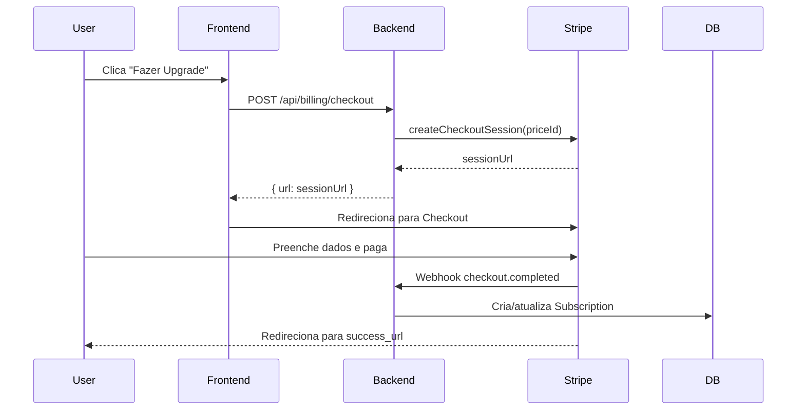

# Stripe Quick Reference — AppFinanceiro

Referência rápida para configuração Stripe em produção.

---

## ⚡ Checklist de Deploy

```bash
# 1. Criar Products e Prices no Stripe Dashboard
✅ Product: AppFinanceiro Pro
  ├─ Price Mensal: R$ 29,90 BRL → price_1...
  └─ Price Anual: R$ 299,00 BRL → price_1...

✅ Product: AppFinanceiro Enterprise
  ├─ Price Mensal: R$ 99,90 BRL → price_1...
  └─ Price Anual: R$ 999,00 BRL → price_1...

# 2. Configurar variáveis de ambiente
✅ STRIPE_SECRET_KEY (sk_live_... para produção)
✅ STRIPE_WEBHOOK_SECRET (whsec_...)
✅ STRIPE_PRICE_PRO_MONTHLY
✅ STRIPE_PRICE_PRO_YEARLY
✅ STRIPE_PRICE_ENTERPRISE_MONTHLY
✅ STRIPE_PRICE_ENTERPRISE_YEARLY
✅ BILLING_PORTAL_RETURN_URL (URL do frontend)

# 3. Configurar Webhook
✅ Endpoint: https://seu-dominio.com/api/billing/webhook
✅ Eventos:
   - checkout.session.completed
   - customer.subscription.created
   - customer.subscription.updated
   - customer.subscription.deleted
   - invoice.payment_succeeded
   - invoice.payment_failed

# 4. Testar fluxo
✅ Checkout Pro Mensal
✅ Checkout Pro Anual  
✅ Checkout Enterprise Mensal
✅ Checkout Enterprise Anual
✅ Customer Portal (gerenciar assinatura)
✅ Cancelamento
✅ Webhooks recebidos
```

---

## 🔑 Chaves de API

### Test Mode
```bash
STRIPE_SECRET_KEY=sk_test_51...
STRIPE_WEBHOOK_SECRET=whsec_...
```

### Production Mode
```bash
STRIPE_SECRET_KEY=sk_live_51...
STRIPE_WEBHOOK_SECRET=whsec_...
```

⚠️ **Nunca commite chaves no Git!**

---

## 💰 Price IDs

### Test Mode (exemplo)
```bash
# Pro
STRIPE_PRICE_PRO_MONTHLY=price_1NXZtest123456
STRIPE_PRICE_PRO_YEARLY=price_1NXZtest789012

# Enterprise
STRIPE_PRICE_ENTERPRISE_MONTHLY=price_1NXZtestABC123
STRIPE_PRICE_ENTERPRISE_YEARLY=price_1NXZtestDEF456
```

### Production (substituir pelos IDs reais)
```bash
STRIPE_PRICE_PRO_MONTHLY=price_1...
STRIPE_PRICE_PRO_YEARLY=price_1...
STRIPE_PRICE_ENTERPRISE_MONTHLY=price_1...
STRIPE_PRICE_ENTERPRISE_YEARLY=price_1...
```

---

## 🧪 Testar localmente

```bash
# 1. Instalar Stripe CLI
brew install stripe/stripe-cli/stripe

# 2. Login
stripe login

# 3. Escutar webhooks locais
stripe listen --forward-to localhost:4000/api/billing/webhook

# 4. Copiar o webhook secret exibido
# Adicionar no .env:
STRIPE_WEBHOOK_SECRET=whsec_...

# 5. Testar
stripe trigger checkout.session.completed
```

---

## 📊 Arquivos relacionados

| Arquivo | Descrição |
|---------|-----------|
| `src/lib/plans.ts` | Definição dos planos (preços exibidos na UI) |
| `server/src/lib/stripe.ts` | Cliente Stripe + mapping de Price IDs |
| `server/src/routes/billing.ts` | Rotas de checkout, portal e webhooks |
| `server/.env` | Variáveis de ambiente (não commitar!) |
| `docs/STRIPE_PRICING_SETUP.md` | Guia completo de configuração |

---

## 🌐 Links úteis

| Recurso | URL |
|---------|-----|
| Dashboard | https://dashboard.stripe.com |
| API Keys | https://dashboard.stripe.com/apikeys |
| Products | https://dashboard.stripe.com/products |
| Webhooks | https://dashboard.stripe.com/webhooks |
| Test Cards | https://stripe.com/docs/testing |
| CLI Docs | https://stripe.com/docs/stripe-cli |

---

## 💳 Cartões de teste

```bash
# Sucesso
4242 4242 4242 4242  (Visa)
5555 5555 5555 4444  (Mastercard)

# Falha genérica
4000 0000 0000 0002

# Requer autenticação (3D Secure)
4000 0027 6000 3184
```

**CVC**: qualquer 3 dígitos  
**Data de expiração**: qualquer data futura  
**CEP**: qualquer valor

---

## 🔄 Fluxo de Checkout



---

**Última atualização:** 21/02/2026
